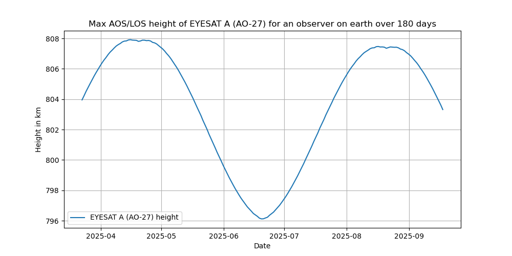

# satellite-apogee-plotter
Plots the maximum height of a specified satellite at a certain position on earth over time.
The main use is to see when a certain amateurradio satellites height peaks at a the observers postion on earth which is also the best time to work long-distance contacts (DX)

This is a WIP and feedback is more than welcomed, especially if you can sanity check the results to check if I made a mistake in the calculations

# Example plots

